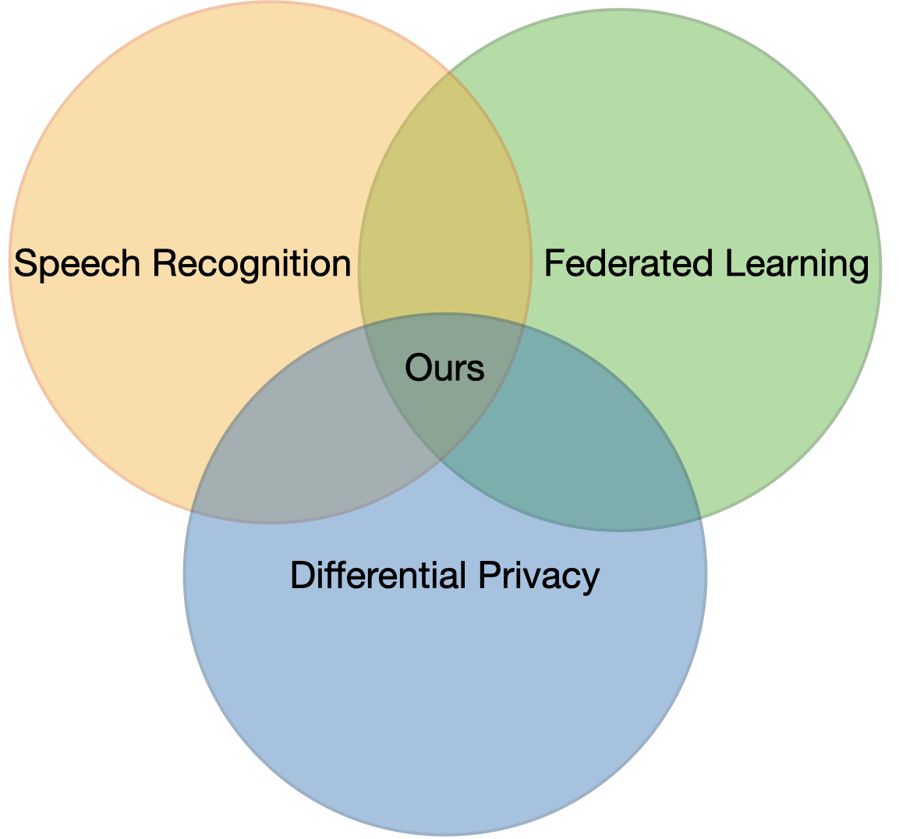
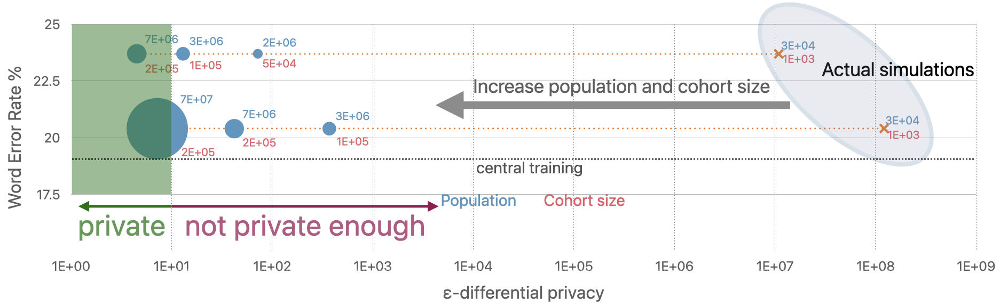

<div align="center">
  <h1>Private Federated Learning for Speech Recognition</h1>

  [](https://arxiv.org/pdf/2310.00098)
  [](https://machinelearning.apple.com/research/fed-learning-diff-privacy)
</div>

This repository accompanies the research paper [**Enabling Differentially Private Federated Learning for Speech Recognition: Benchmarks, Adaptive Optimizers and Gradient Clipping**](https://arxiv.org/pdf/2310.00098) by 
*Martin Pelikan, Sheikh Shams Azam, Vitaly Feldman, Jan “Honza” Silovsky, Kunal Talwar, Christopher G. Brinton, Tatiana Likhomanenko*.

## TL;DR

<p align="center">
  <a href="path/to/file.pdf">
    
  </a>
</p>


We establish the first baselines for ASR with private federated learning.
Results suggest strong DP guarantees for million-level populations.

This repository contains a full reproduction of results from the paper and enables simple further experimentation.
Our implementation provides an optimized data loader using PFL-aware design, achieves better GPU utilization during client and server training, and overall better parallelization without the need for fast interconnect between GPUs.

## Abstract

While federated learning (FL) and differential privacy (DP) have been extensively 
studied, their application to automatic speech recognition (ASR) remains largely
unexplored due to the challenges in training large transformer models. Specifically,
large models further exacerbate issues in FL as they are particularly susceptible to
gradient heterogeneity across layers, unlike the relatively uniform gradient behavior
observed in shallow models. As a result, prior works struggle to converge with
standard optimization techniques, even in the absence of DP mechanisms. To the
best of our knowledge, no existing work establishes a competitive, practical recipe
for FL with DP in the context of ASR. To address this gap, we establish **the first
benchmark for FL with DP in end-to-end ASR**. Our approach centers on per-layer
clipping and layer-wise gradient normalization: theoretical analysis reveals that
these techniques together mitigate clipping bias and gradient heterogeneity across
layers in deeper models. Consistent with these theoretical insights, our empirical
results show that FL with DP is viable under strong privacy guarantees, provided
a population of at least several million users. Specifically, we achieve user-level
(7.2, 10^−9)-DP (resp. (4.5, 10^−9)-DP) with only a 1.3% (resp. 4.6%) absolute
drop in word error rate when extrapolating to high (resp. low) population scales
for FL with DP in ASR. Although our experiments focus on ASR, the underlying
principles we uncover — particularly those concerning gradient heterogeneity and
layer-wise gradient normalization — offer broader guidance for designing scalable,
privacy-preserving FL algorithms for large models across domains.

<p align="center">
  <a href="path/to/file.pdf">
    
  </a>
</p>


## Software Design

Our implementation achieves better GPU utilization during client and server training and overall better parallelization without the need for fast interconnect between GPUs. We also provide optimized data loading. The key steps are:

- Every client has an associated `mlx-data` data loader to efficiently prefetch data
- Each client is always trained on a single GPU: we found this configuration to be optimal for parallelization
- Each GPU trains several clients sequentially: more GPUs used means more clients can be optimized in parallel
- A replica of the server model is stored on every GPU, thus clients on that GPU can be aggregated efficiently without the need for high-speed interconnect
- After every GPU has trained and aggregated its portion of clients, the server model states are aggregated across GPUs

This design allows efficient training even on clusters with poor interconnect.
The code is written in JAX, but the overall architecture can be (directly) reimplemented in PyTorch.

## 📁 Repository Structure

- `experiments/configs` contains configs for main models from the paper
- `experiments/train_central.py` training and evaluation code for central models
- `experiments/train_pfl.py` training and evaluation code for federated learning (with differential privacy support) models
- `pfl4asr` - package with main logic, like modules, data loader, train and eval function, etc.

## 🔧 Requirements
- python 3.10 or higher
- jax
- flax
- optax
- einops
- mlx-data
- simple_parsing
- sox (for data preparation)

We also provide `Dockerfile` which installs all dependencies.

## Getting Started

### Install Dependencies
Install `pfl4asr`:

```
pip install pfl4asr/
```

You are all set with dependencies!

### Prepare Data

#### Installation for data processing

- install sox `sudo apt-get install sox`
- install python sox `pip install sox`

#### Librispeech (LS)

Download and prepare audio and text data

```bash
bash experiments/data/ls/preprocess.sh
```

This should create the following structure:

```bash
experiments/
            train-clean-100.tar
            train-clean-360.tar
            train-other-500.tar
            dev-clean.tar
            dev-other.tar
            test-clean.tar
            test-other.tar

experiments/lists/
                  train-all-960.csv
                  train-860.csv
                  dev-clean.csv
                  dev-other.csv
                  test-clean.csv
                  test-other.csv
```

- prepare lists for training models for federated learning:

```bash
bash experiments/setup_ls.sh
```

#### Common Voice (CV)

- Download the Common Voice data from https://commonvoice.mozilla.org/en/datasets to `experiments` folder - we used version `v13.0` - for `en`, `fr`, `de` languages
- Preprocess audio and text data for all languages

```bash
bash experiments/data/cv/preprocess.sh
```

This should create the following structure:

```bash
experiments/
            en.tar
            fr.tar
            de.tar
experiments/lists/
                  en-train.csv
                  en-dev.csv
                  en-test.csv
                  fr-train.csv
                  fr-dev.csv
                  fr-test.csv
                  de-train.csv
                  de-dev.csv
                  de-test.csv
```

- prepare lists for training models for both central and federated learning in particular language `lang` (`en`, `fr`, `de`):

```bash
bash experiments/setup_cv.sh $lang
```

Now you are ready to run models training!

## 🚀 Train Models

We are running JAX with 1 process per GPU for efficiency. Known issue of JAX hang with GPU for the version we use can be resolved by `export XLA_FLAGS=--xla_gpu_shard_autotuning=false`.

To check available config use `python experiments/train_central.py --help` for central training or `python experiments/train_pfl.py --help` for federated learning training.

### Train central baselines

All central baselines are trained on 8GPUs only. Use configurations from `experiments/configs/central_baseline_*.yaml`:
- e.g. training on full Common Voice for language `lang` (`en`, `fr`, `de`):

```bash
cd experiments
for i in $(seq 0 7) 
do 
  CUDA_VISIBLE_DEVICES=$i python train_central.py --config_path configs/central_baseline_cv_$lang.yaml --shared_config.world_size 8 --shared_config.rank $i & 
done
```

- e.g. training on full Librispeech:

```bash
cd experiments
for i in $(seq 0 7) 
do 
  CUDA_VISIBLE_DEVICES=$i python train_central.py --config_path configs/central_baseline_ls.yaml --shared_config.world_size 8 --shared_config.rank $i & 
done
```

### Train federated learning models

To have faster training we recommend to run with multi-node (just specify the main node ip address and port via `--shared_config.host_ip_address=$IP --shared_config.distributed_port=$PORT`). Otherwise here are examples to run on 1 node with 8GPUs:
- e.g. training on full Common Voice from scratch in federated learning regime with 10 epochs per client for `en`:

```bash
cd experiments
for i in $(seq 0 7) 
do 
  CUDA_VISIBLE_DEVICES=$i python train_pfl.py --config_path configs/fl_cv.yaml --shared_config.world_size 8 --shared_config.rank $i & 
done
```

- e.g. training on full Common Voice from Librispeech 100h checkpoint in federated learning regime with 10 steps per client and 16 clients for `en`:

```bash
cd experiments
for i in $(seq 0 7) 
do 
  CUDA_VISIBLE_DEVICES=$i python train_pfl.py --config_path configs/pfl_ls_100_to_cv_no_dp.yaml --shared_config.world_size 8 --shared_config.rank $i --pfl_config.cohort_size=16 & 
done
```

### Train federated learning with differential privacy models

To have faster training we recommend to run with multi-node (just specify main node ip address and port via `--shared_config.host_ip_address=$IP --shared_config.distributed_port=$PORT`). Otherwise here is example to run on 1 node with 8GPUs:
- e.g. training on full Common Voice from Librispeech 100h checkpoint in federated learning + differential privacy regime with 10 steps per client and 1024 clients for `en`:

```bash
cd experiments
for i in $(seq 0 7) 
do 
  CUDA_VISIBLE_DEVICES=$i python train_pfl.py --config_path configs/pfl_ls_100_to_cv.yaml --shared_config.world_size 8 --shared_config.rank $i --pfl_config.cohort_size=1024 & 
done
```

**Note**: the `dp_config.dp_sigma` defines $C\sigma_{DP}$ ($C$ is a clipping constant) from the paper.

## 📝 Citation
If you use our code for your experiments or you find our work useful, please cite our paper:

```bibtex
@article{pflasr2025,
  title={Enabling Differentially Private Federated Learning for Speech Recognition: Benchmarks, Adaptive Optimizers and Gradient Clipping},
  author={Pelikan, Martin and Azam, Sheikh Shams and Feldman, Vitaly and Silovsky, Jan and Talwar, Kunal,  and Brinton, Christopher G. and Likhomanenko, Tatiana},
  journal={arXiv preprint arXiv:2310.00098},
  year={2025}
}
```

## 📄 License

Repository is released under the [LICENSE](LICENSE).